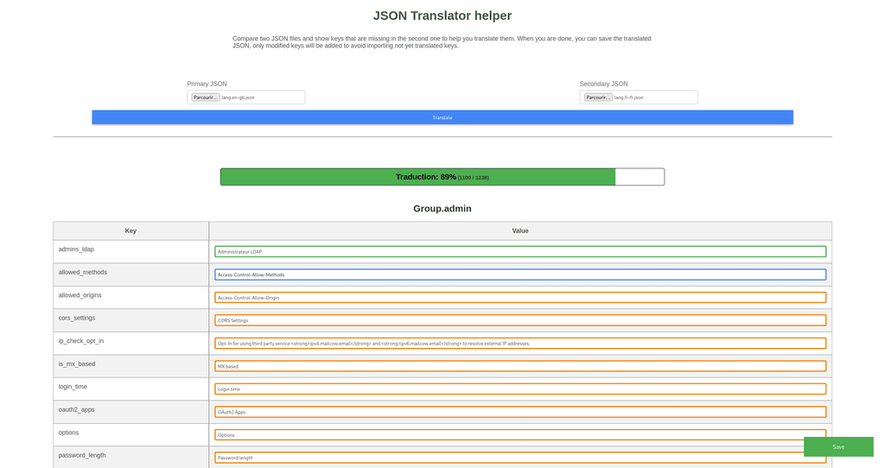

# 🌍 JSON Translator Helper
[](https://github.com/IGLOU-EU/json-translator-helper/fork)
[](LICENSE)

Tools like weblate drive me nuts. I don't want to deal with a complex interface and a sign-up process, or take my head in an infinite JSON file to translate a few keys. Even more if a just want to translate a WIP feature before making a pull request.

That's why, I created this tiny tool which I can use offline !   
So, just translate your JSON stuff and be done with it.

## Features wishlist ✨
If I have the time, I would like to add the following features:

- [ ] Customizable white space (including indentation, line break characters, etc.)
- [ ] Enable/disable sorting of keys (actually, it's always enabled)
- [ ] Support online JSON files (like from raw github content)
- [ ] Generic JSON format (not only the mailcow one)

## What does it do 🛠
The tool compares two JSON files and identifies keys that are missing in the second one to ease the translation process. Once you're finished, you can save the translated JSON file. Only the modified keys will be added to avoid importing keys that haven't been translated yet.

Visually, it looks like this:   
[](screenshot.png)

## How to use it 👩‍🔧
It is specifically built to use from a web brother, because... web interface and stuff like that, you know...   
Because of the one file design, it doesn't need any external resources or server to run, and you can use it online or offline.

### Online
You can use it online at the following address: [https://iglou-eu.github.io/json-translator-helper/](https://iglou-eu.github.io/json-translator-helper/)

### Offline
You can also use it offline by downloading the repository and opening the `index.html` file in your favorite web browser.

## JSON Format 📝
The expected JSON format is based on the Mailcow translation files. Because it is the format I need to translate, when I created this tool.

It is as follows:
```json
{
    "group1": {
        "key1": "value1",
        "key2": "value2",
        "key3": "value3"
    },
    "group2": {
        "key1": "value1",
        "key2": "value2",
        "key3": "value3"
    }
}
```